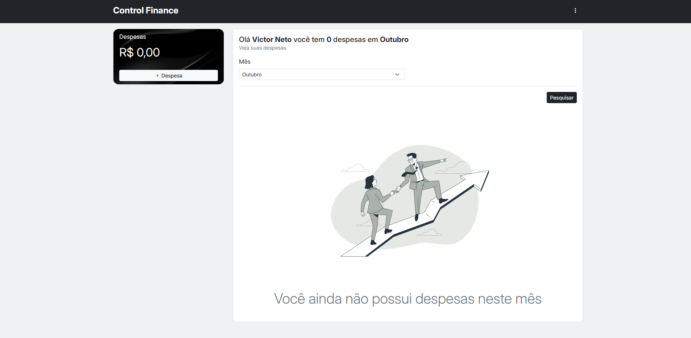
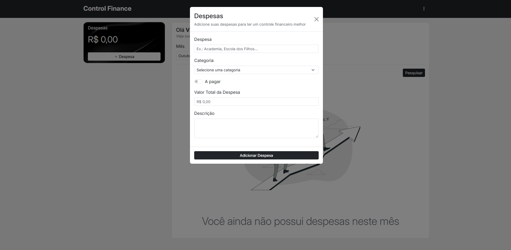
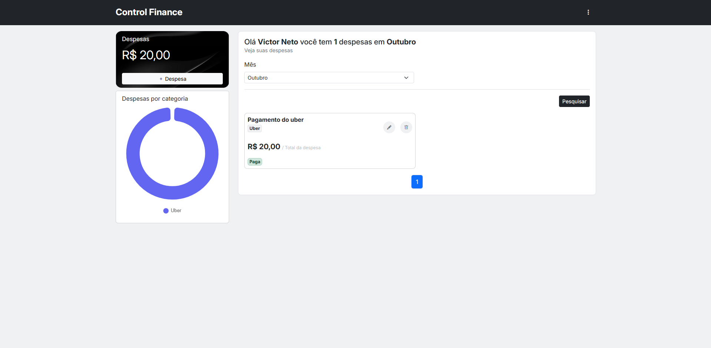
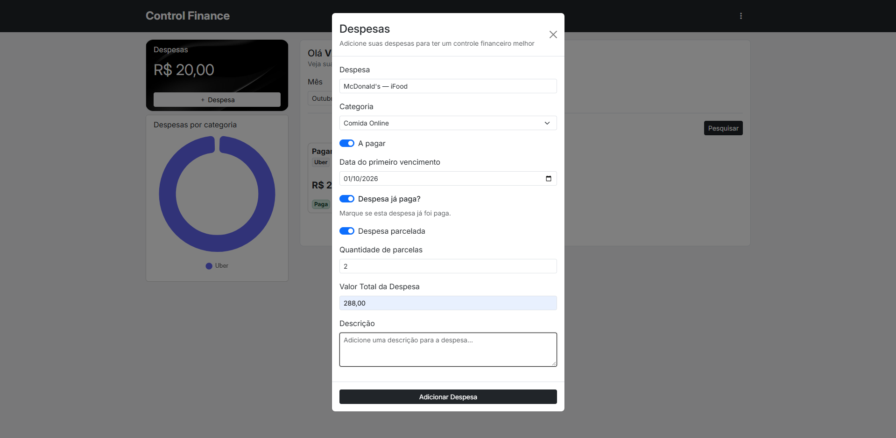
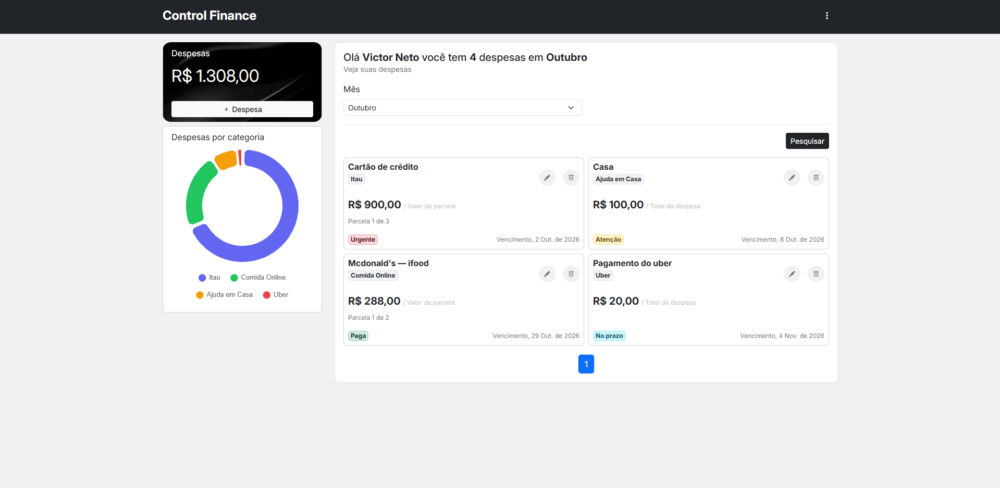
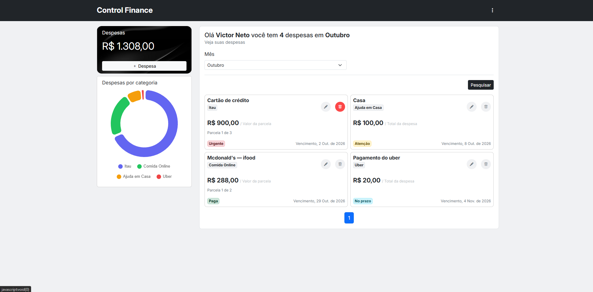
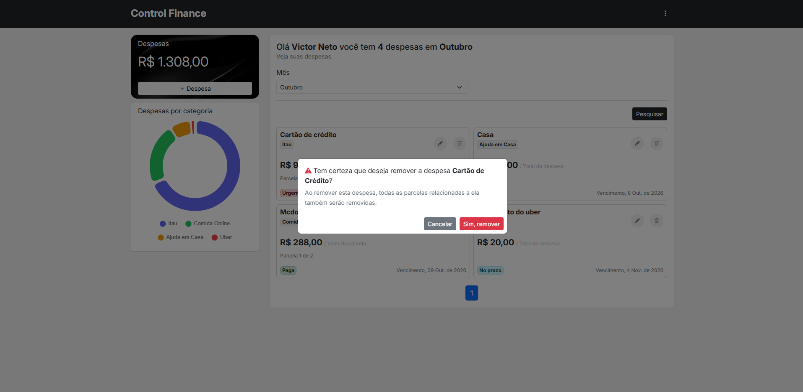
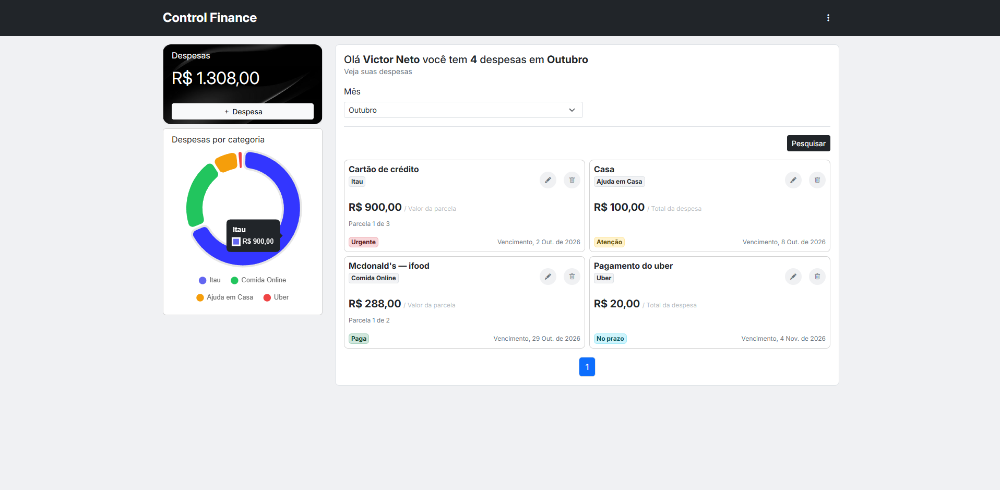

# Controle Financeiro


O Controle Financeiro é um sistema desenvolvido para auxiliar no gerenciamento e organização das despesas pessoais. A aplicação permite registrar, consultar e acompanhar os gastos realizados, facilitando a visualização de como o dinheiro está sendo utilizado ao longo dos meses.

O sistema organiza as despesas por categorias e períodos, permitindo que o usuário acompanhe seus gastos de forma mais clara e tenha uma visão geral de sua situação financeira. Também é possível controlar despesas parceladas, acompanhar vencimentos e visualizar os valores gastos em cada categoria.

A proposta do projeto é tornar o controle das finanças pessoais mais simples e acessível, ajudando o usuário a entender para onde seu dinheiro está indo e a acompanhar seus gastos de maneira organizada.

> Projeto desenvolvido **Full Stack**, portanto a documentação está dividida em duas partes: **Back-End**, responsável pela documentação dos endpoints e funcionalidades utilizando **JSON** e **JWT**; e **Front-End**, responsável pela documentação da interface e integração com a API.

###### Desenvolvedor

**Victor Chinaglia** — [chinagliadev.github.io](https://chinagliadev.github.io/)

## Front End

   

### Login

Ao iniciar o sistema, a primeira tela apresentada é a **tela de login**, onde o usuário deve informar seu **E-mail** e **Senha** para realizar a autenticação.


### Cadastro

Caso o usuário ainda não possua uma conta, poderá realizar seu **cadastro** no sistema para obter acesso às funcionalidades da aplicação.


### Início

Após a validação das credenciais, o usuário é autenticado e direcionado para a **tela inicial** do sistema, onde poderá acessar as principais funcionalidades da aplicação.



### Criar Despesas

Para cadastrar uma nova despesa, o usuário deve clicar no botão **+ Despesas**. Em seguida, será exibido um **modal** contendo os campos necessários para o preenchimento e registro da despesa.



### Visualização das despesas

Após o cadastro, a despesa é apresentada em um **card** contendo as principais informações, como **categoria**, **valor total** e **status**. O card também disponibiliza as opções para **editar** ou **remover** a despesa.

Quando a despesa não possui parcelamento, seu status é definido automaticamente como **Pago**.



### Cadastrar Despesas com Vencimento ou Parcelamento

O sistema também permite cadastrar despesas que possuem **data de vencimento** ou **parcelamento**. Ao informar essas opções, é possível definir a quantidade de parcelas e acompanhar individualmente o status de pagamento de cada uma delas.

Dessa forma, o sistema mantém o controle das despesas futuras e permite acompanhar quais parcelas já foram **pagas** e quais ainda estão **pendentes**.



### Status de despesas

Cada despesa possui um **status** que representa sua situação atual no sistema:

**🔵 No prazo** — despesa com vencimento a partir de 10 dias.

**🟡 Atenção** — despesa com vencimento entre 6 e 9 dias.

**🔴 Urgente** — despesa com vencimento hoje ou nos próximos 5 dias.

**🔴 Vencida** — despesa que ultrapassou a data de vencimento sem registro de pagamento.

**🟢 Paga** — despesa que já foi marcada como paga.



### Remover Despesa

Caso queira remover uma despesa, o usuário deve clicar no ícone de **lixeira** localizado no card da despesa. Em seguida, será exibido um **modal de confirmação** para confirmar a remoção.



> Modal de confirmação



#### Gráfico de Despesas

A tela inicial também conta com um **gráfico de despesas por categoria**, desenvolvido com a biblioteca **Chart.js**. Ele mostra de forma visual como o dinheiro está distribuído, e cada fatia (ou barra) representa uma categoria, como Alimentação, Transporte ou Lazer.

Com isso, o usuário consegue identificar rapidamente **quais categorias concentram mais gastos** e onde vale a pena economizar. Quanto maior a fatia, maior o valor gasto naquela categoria.

O gráfico é alimentado pelo endpoint `GET /despesas/totalCategoriaDespesas`, que retorna o total das despesas agrupadas por categoria, e acompanha o **filtro por mês**: ao trocar o mês, os valores do gráfico são atualizados.



## Back-End

       

> Documentação da API, endpoints, autenticação e funcionalidades do sistema.

#### Tecnologias e versões

| Tecnologia | Versão |
|---|---|
| Java  | 26 |
| Spring Boot  | 4.1.0 |
| Maven  | 3.9+ |
| Spring Data JPA / Hibernate  | gerenciado pelo Spring Boot |
| Spring Security  | gerenciado pelo Spring Boot |
| Spring Validation  | gerenciado pelo Spring Boot |
| Spring Web MVC  | gerenciado pelo Spring Boot |
| MySQL Connector/J  | gerenciado pelo Spring Boot |
| java-jwt (Auth0)  | 4.5.0 |
| MapStruct  | 1.6.3 |
| Lombok  | gerenciado pelo Spring Boot |
| springdoc-openapi (Swagger UI)  | 3.1.1 |

#### Pré-requisitos de uso

Antes de começar, você precisa ter instalado:

- [JDK 26](https://jdk.java.net/)
- [Maven 3.9+](https://maven.apache.org/) (ou use o `mvnw` do projeto, se existir)
- [MySQL 8+](https://dev.mysql.com/downloads/)
- Git

#### Configuração

##### 1. Clone o repositório

```bash
git clone https://github.com/chinagliadev/control-finance.git
cd control-finance
```

##### 2. Crie o banco de dados

```sql
CREATE DATABASE control_finance;
```

##### 3. Configure o `application.properties`

Em `src/main/resources/application.properties`:

```properties
server.port=3300

spring.datasource.url=jdbc:mysql://localhost:3306/control_finance
spring.datasource.username=SEU_USUARIO
spring.datasource.password=SUA_SENHA

spring.jpa.hibernate.ddl-auto=update
spring.jpa.show-sql=true

# Chave secreta usada para assinar o JWT (ajuste para o nome da sua propriedade)
api.security.token.secret=SUA_CHAVE_SECRETA
```

> Lembrando DEV, nunca suba usuário, senha ou chave secreta reais para o GitHub. Use variáveis de ambiente.

#### Introdução de uso

##### Rodando com Maven

```bash
mvn spring-boot:run
```

##### Ou gerando o `.jar`

```bash
mvn clean package
java -jar target/control-finance-0.0.1-SNAPSHOT.jar
```

##### A aplicação sobe em: **http://localhost:3300**

---

#### Documentação da API (Swagger)

> Caso prefira uma visualização mais prática dos endpoints, o projeto disponibiliza a documentação da API por meio do Swagger.

Com a aplicação rodando, acesse:

| Recurso | URL |
|---|---|
| Swagger UI | http://localhost:3300/swagger-ui/index.html |
| OpenAPI (JSON) | http://localhost:3300/v3/api-docs |

#### Liberando o Swagger no Spring Security

Como o projeto usa Spring Security, as rotas do Swagger precisam estar liberadas no `SecurityConfig`:

```java
.requestMatchers(
    "/swagger-ui/**",
    "/swagger-ui.html",
    "/v3/api-docs/**"
).permitAll()
```

#### Testando endpoints protegidos no Swagger

1. Faça `POST /auth/login` pelo próprio Swagger UI.
2. O token é salvo em um **cookie HttpOnly** chamado `token`, e o navegador o envia automaticamente nas próximas requisições.
3. Agora é só executar os demais endpoints pelo botão **Try it out**.

---

### Requisições

> OBS: Os caminhos e campos abaixo são exemplos. Confira os detalhes sempre no Swagger.

#### Autenticação (`/auth`)

##### Registrar usuário

`POST /auth/registrar`

```json
{
  "nome": "Victor",
  "email": "victor@email.com",
  "cpf": "00000000000",
  "senha": "123456"
}
```

##### Login

`POST /auth/login`

```json
{
  "email": "victor@email.com",
  "senha": "123456"
}
```

Resposta: o token JWT é gravado no cookie `token` (HttpOnly), com validade de 24 horas.

##### Buscar usuário autenticado

`GET /auth/me`

Retorna o **nome** e o **e-mail** do usuário logado. Não precisa de body, o usuário é identificado pelo cookie `token`.

##### Logout

`POST /auth/logout`

Encerra a sessão removendo o cookie `token`. Não precisa de body.

---

#### Categorias (`/categorias`)

##### Listar categorias

`GET /categorias`

Retorna todas as categorias cadastradas para o usuário. Não precisa de parâmetros.

##### Criar categoria

`POST /categorias`

```json
{
  "nome": "Alimentação",
  "status": true
}
```

> Se `status` não for informado, o padrão é `true`.

##### Atualizar categoria

`PUT /categorias/{id}`

> O ***PUT*** funciona utilizando o mesmo formato de body utilizado pelo ***POST***.

##### Atualizar status da categoria

`PATCH /categorias/{id}`

Atualiza o status da categoria informada pelo `id`. Não precisa de body.

---

#### Despesas (`/despesas`)

##### Criar despesa

`POST /despesas`

```json
{
  "nome": "Notebook",
  "descricao": "Compra parcelada",
  "valor": 4800.00,
  "dataDespesa": "2026-10-01",
  "dataVencimento": "2026-11-01",
  "aPagar": true,
  "parcelado": true,
  "quantidadeParcela": 8,
  "categoriaId": 1
}
```

> As parcelas só são geradas quando aPagar **e** parcelado são do status ***true***.

##### Atualizar despesa

`PUT /despesas/{id}`

> O ***PUT*** funciona utilizando o mesmo formato de body utilizado pelo ***POST***.

##### Atualizar status da despesa

`PATCH /despesas/{id}`

Atualiza o status da despesa informada pelo `id`. Não precisa de body.

##### Listar despesas (paginado, com filtro por mês)

`GET /despesas?mes=10&page=0&size=10`

- `mes` (opcional): mês de referência para consulta das despesas.
  - `1` — Janeiro
  - `2` — Fevereiro
  - `3` — Março
  - `4` — Abril
  - `5` — Maio
  - `6` — Junho
  - `7` — Julho
  - `8` — Agosto
  - `9` — Setembro
  - `10` — Outubro
  - `11` — Novembro
  - `12` — Dezembro

- `page` (opcional, padrão `0`): número da página que deseja consultar.

- `size` (opcional, padrão `6`): quantidade de despesas que devem ser retornadas por página.

##### Total de despesas

`GET /despesas/total?mes=10`

Calcula o valor total das despesas do usuário.

`mes` (opcional): se informado, calcula o total apenas do mês escolhido (valores de `1` a `12`).

##### Total de despesas por categoria

`GET /despesas/totalCategoriaDespesas?mes=10`

Calcula o total das despesas agrupadas por categoria (usado para o gráfico).

`mes` (opcional): se informado, calcula os totais apenas do mês escolhido (valores de `1` a `12`).

---

### Estrutura do projeto

O projeto segue uma estrutura baseada nos padrões do **Spring Boot** e na arquitetura **MVC (Model-View-Controller)**, mantendo as responsabilidades separadas por camadas.

```
src/main/java/dev/chinaglia/control_finance
├── config         # SecurityConfig, TokenConfig, AuthConfig
├── controllers    # Endpoints REST (Auth, Categoria, Despesa)
├── dto            # Requests / Responses
├── entitdades     # Entidades JPA (Despesa, Categoria, Parcela...)
├── mapper         # MapStruct
├── repository     # Spring Data JPA
├── response       # ApiResponse e ResponseUtil (padrão de resposta da API)
├── service        # Regras de negócio
└── exception      # Exceções customizadas
src/main/resources
├── static         # Front-end (HTML/CSS/JS)
└── application.properties
```

## Futuras implementações

 

#### Exportação para Excel

Permitir que o usuário exporte suas despesas para uma planilha **Excel (.xlsx)**, com filtro por mês e por categoria. Muita gente já organiza as finanças em planilhas, então essa exportação facilita a análise dos dados fora do sistema, backups e a comparação com outros controles.

####  Relatórios com JasperReports

Gerar **relatórios em PDF** com o **JasperReports**, como o resumo mensal, o total por categoria e as parcelas a vencer. A ideia é dar ao usuário um documento pronto, bem formatado e fácil de imprimir ou compartilhar, complementando o gráfico da tela inicial.
